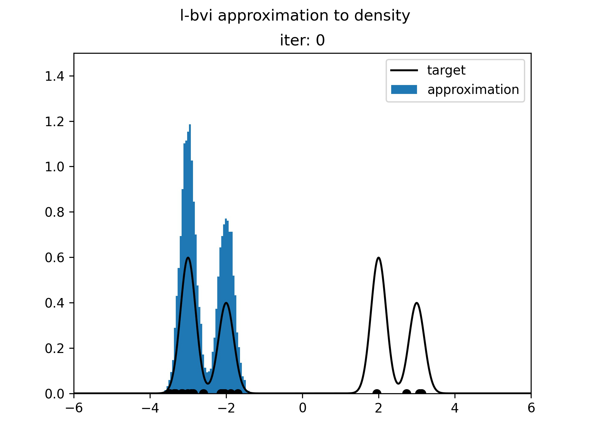

# Locally-Adapted Boosting Variational Inference (L-BVI)

This repository contains a Python package that can be used to do Bayesian inference using locally-adapted boosting variational inference (L-BVI).  

  
  

## Repository Status

todo

## Installation and Dependencies

 todo

## Examples

## Directory roadmap

Each directory contains its own README file. In general:
- `lbvi` contains the main functions used for L-BVI Bayesian inference
- `examples` contains self-contained examples that approximate one of the target distributions in its `targets` subdirectory
- `tests` contains tests used for the paper; see README within for reproducibility

### todo
- add `setup.py` in root
- populate README
- add license
